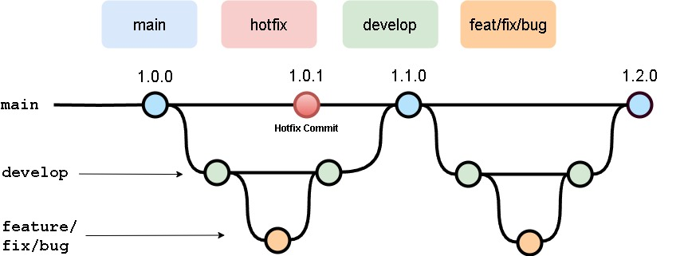

# EGC - mantecao-hub

# Metodología de Trabajo

## Historial de versiones
| Nombre de la versión | Cambios |
|-------------------------|-------------------------|
| v1.0 | Documento inicial |

## Índice

- [EGC - mantecao-hub](#egc---mantecao-hub)
- [Metodología de Trabajo](#metodología-de-trabajo)
  - [Historial de versiones](#historial-de-versiones)
  - [Índice](#índice)
  - [Contribuyentes](#contribuyentes)
  - [Introducción](#introducción)
  - [Política de gestión de commits](#política-de-gestión-de-commits)
    - [Commits atómicos](#commits-atómicos)
      - [Definición de Commit Atómico](#definición-de-commit-atómico)
      - [Procedimiento para realizar Commits Atómicos](#procedimiento-para-realizar-commits-atómicos)
    - [Revisiones, fixes y pull request](#revisiones-fixes-y-pull-request)
    - [Hotfixes](#hotfixes)
  - [Política de gestión de issues](#política-de-gestión-de-issues)
    - [Etiquetado básico](#etiquetado-básico)
    - [Asignación de responsables](#asignación-de-responsables)
    - [Milestones](#milestones)
    - [Asignación a proyectos y tableros](#asignación-a-proyectos-y-tableros)
    - [Seguimiento y actualización](#seguimiento-y-actualización)
    - [Cierre de issues](#cierre-de-issues)
  - [Política de gestión de ramas](#política-de-gestión-de-ramas)
    - [GitFlow como Estrategia de Gestión de Ramas](#gitflow-como-estrategia-de-gestión-de-ramas)
    - [Ramas Principales](#ramas-principales)
    - [Ramas de Soporte](#ramas-de-soporte)
  - [Procedimiento en caso de no cumplimiento](#procedimiento-en-caso-de-no-cumplimiento)

## Contribuyentes
| Nombre del contribuyente |
|-------------------------|
| Samuel Albalat Ortiz | 
| Pablo Alcántara Bernal |
| Adrián García Chavero |
| Álvaro Hidalgo Rodríguez |
| Nerea Jiménez Adorna |
| Santiago Rosado Raya |

## Introducción

A continuación se presenta el documento de las políticas del trabajo en el proyecto, en el cual se va a especificar y explicar los procedimientos que se han de seguir en el proyecto a la hora de trabajar de forma ideal.

## Política de gestión de commits

Como política de gestión de commits emplearemos como base la metodología de **Conventional Commits** especificada en el siguiente documento: [**Conventional Commits** en español](https://www.conventionalcommits.org/es/v1.0.0/). 

Además, hemos decidido extender nuestras políticas para facilitar aún más la gestión del proyecto. Los añadidos se especifican a continuación.

### Commits atómicos

#### Definición de Commit Atómico
Un commit atómico es aquel que representa un único cambio o, en su defecto, conjunto de cambios relacionados entre sí, realizado en un repositorio de código, de manera que:
- Soluciona un problema específico o agrega una funcionalidad independiente.
- No incluye cambios innecesarios ni mezclados con otros cambios que resuelvan problemas distintos.
- Facilita la revisión del código, revertir cambios si es necesario y mantener el historial del proyecto claro y legible.

#### Procedimiento para realizar Commits Atómicos
- **Cambios pequeños y enfocados**: Cada commit debe contener solo los cambios necesarios para solucionar un problema o agregar una funcionalidad específica.
- **No mezclar tipos de cambios**: Evitar combinar cambios que resuelvan problemas distintos, como correcciones de bugs junto con nuevas funcionalidades.
- **Mensajes de commit descriptivos**: El mensaje de cada commit debe explicar claramente qué cambios se realizaron y por qué.
- **Testear antes de commitear**: Asegurarse de que el código compila correctamente y pasa todas las pruebas antes de hacer un commit. Esto garantiza que cada commit sea un estado funcional del código.
- **Frecuencia de commits**: Se recomienda hacer commits frecuentemente para que los cambios puedan ser revisados y revertidos fácilmente, en lugar de acumular grandes cantidades de código en un solo commit.

### Revisiones, fixes y pull request
En el caso específico de las revisiones, siempre en el footer del commit hemos de colocar nuestro nombre precedido por "Reviewed-by:", adicionalmente si se trata de un fix o similar es importante colocar en el footer "Refs:#Número-de-la-issue", considerando que dicho número ha de hacer referencia a la issue relacionada

En el caso de las pull request se espera tanto el reviewer con "Reviewed-by:" como una descripción clara de lo comprobado independientemente de que sea exitosa o no la revisión de la misma de cara a la aceptación de cambios.

### Hotfixes
En el caso específico de que la rama principal presente errores urgentes se hará un "commit hotfix", estos han de inidicar claramente su issue referida usando "Refs:#Número-de-la-issue" en el mensaje, y describir los cambios y ser acompañados posteriormente por un segundo commit de revisión considerando que en el primero todo se encontraba en estado funcional y solventado donde se indique tanto la issue con "Refs:#Número-de-la-issue" como el reviewer con  el footer "Reviewed-by:"

---

## Política de gestión de issues
Esta política define cómo gestionar las issues en el proyecto utilizando **GitHub**. El objetivo es organizar, priorizar y dar seguimiento eficiente a cada tarea dentro del ciclo de desarrollo.

### Etiquetado básico
Cada **issue** debe contar con al menos las siguientes etiquetas:
- **Tipo de issue:**
  - `feature`: Para nuevas funcionalidades.
  - `enhancement`: Para mejoras a funcionalidades existentes.
  - `fix`: Para correciones de funcionalidades ya hechas
  - `hotfix`: Para correciones urgentes en la rama principal
  - `bug`: Para reportes de errores.
  - `documentation`: Para tareas de documentación.

### Asignación de responsables
- **Cada issue** debe tener **dos personas asignadas**: Esto asegura revisión y cooperación en cada tarea.

### Milestones
- Todas las **issues** deben estar vinculadas a una **milestone** específica que coincida con el período de trabajo que se determine en la organicación de la asignatura.

### Asignación a proyectos y tableros
- Cada issue debe estar vinculada a uno de los **proyectos** de GitHub definidos para el equipo. Esto permite visibilidad clara en el tablero del proyecto y facilita el seguimiento en conjunto.
Para organizarlas existen **dos tableros**:
  - **Tablero de desarrollo**: Para gestionar el desarrollo general de las features y nuevas funcionalidades.
Donde se establecen los siguientes campos:
    - `Prioridad`: con valores {P0,P1,P2}, dónde P0 es la de mayor prioridad y P2 la de menos. Las prioridades deben ser claramente definidas para asegurar que las tareas críticas o bloqueantes sean atendidas primero.
    - `Tamaño`: con valores {XS,S,M,L,XL}. Indican el tamaño de la issue, su alcance o en su defecto su envergadura.
    - `Estimación`: en horas totales a invertir idealmente
    - `Fecha inicio`: en que fecha pasa a estar en progreso.
    - `Fecha fin`: en que fecha pasa a estar hecha.
  - **Tablero de bugs**: Exclusivo para la gestión y resolución de errores. Posee los mismos campos que el tablero de desarrollo.
  
  Las issues deben ser asignados al **tablero correspondiente** según su tipo (feature/documentation/enhacement o bug/fix).

### Seguimiento y actualización
- Los responsables deben actualizar las **issues** de manera regular con comentarios y avances. 

### Cierre de issues
- Una issue se considera cerrada cuando:
  - Se ha completado la tarea y se ha revisado el código.
  - Se han actualizado los tableros y se ha movido la issue a `Hecho`.

---

## Política de gestión de ramas
### GitFlow como Estrategia de Gestión de Ramas
Este proyecto sigue la estrategia de ramificación **GitFlow**, que define un flujo de trabajo claro para el desarrollo de nuevas funcionalidades, corrección de bugs y despliegues de producción. El uso de GitFlow asegura que las ramas estén organizadas y que cada etapa del ciclo de desarrollo esté bien delimitada.



### Ramas Principales
Las siguientes ramas serán permanentes y existirán a lo largo del proyecto:
- `main`: Contiene el código en estado **estable** que ha sido lanzado a producción.
- `develop`: Ramas destinadas al **desarrollo** y contienen el código que está listo para ser probado antes de pasar a producción.

### Ramas de Soporte
GitFlow utiliza ramas adicionales para gestionar características específicas, correcciones de errores y versiones. Las principales ramas de soporte son:

- **Feature**: Para el desarrollo de nuevas funcionalidades. Cada nueva funcionalidad o tarea debe desarrollarse en una rama de característica (feature branch). El nombre de la rama debe seguir el siguiente formato:

```
Feat-N/Nombre-de-la-issue
```

Donde:
- `N` es el número de la issue asignada en el sistema de seguimiento de GitHub.
- `Nombre-de-la-issue` es una descripción breve pero clara de la funcionalidad que se va a desarrollar.

Si se está desarrollando la funcionalidad relacionada con la issue #3 llamada "Diseñar las políticas de gestión", la rama se llamaría:
```
Feat-3/Diseñar-las-politicas-de-gestión
```

- **Fix**: Para el cambio de funcionalidades ya hechas. Cada arreglo debe desarrollarse en una rama de característica (fix branch). El nombre de la rama debe seguir el siguiente formato:

```
Fix-N-M/Nombre-del-fix
```

Donde:
- `N` es el número de la issue que corresponde a lo que se está arreglando en el sistema de seguimiento de GitHub.
- `M` es el número de la issue asignada en el sistema de seguimiento de GitHub donde quedan registrado el arreglo.
- `Nombre-del-fix` es una descripción breve pero clara del arreglo que se va a realizar.

Si se está arreglado la funcionalidad relacionada con la issue #3, y es la primera rama de arreglo que se crea, la rama se llamaría:
```
Fix-3-1/Fallo-de-inicio
```

- **Bug**: Para cambios no urgentes del proyecto. Debe desarrollarse en una rama de característica (bug branch). El nombre de la rama debe seguir el siguiente formato:

```
Bug-N/Nombre-del-bug
```

Donde:
- `N` es el número de la issue asignada en el sistema de seguimiento de GitHub donde quedan registrado el arreglo.
- `Nombre-del-bug` es una descripción breve pero clara del arreglo que se va a realizar.

Si se está solventando el bug relacionado con la issue #3, la rama se llamaría:
```
Bug-3-1/Usuario-en-formato-desconocido

```
---

## Procedimiento en caso de no cumplimiento

El cumplimiento de estas políticas será monitoreado mediante revisiones de código (pull requests). Cada miembro del equipo debe adherirse a estas políticas. En caso de no cumplirlas se considerarán como errores y tendrán que ser solucionados en el menor tiempo posible, con una prioridad P0.